<<<<<<< HEAD
# Stellar-EncryptedPay

> **Privacy-first payment protocol built on Soroban — confidential transfers, encrypted streaming, and private payment channels on Stellar.**

[](LICENSE)
[-0F6E56)](https://stellar.org/blog/developers/announcing-stellar-x-ray-protocol-25)
[](https://soroban.stellar.org)
[](https://docs.circom.io)
[](https://github.com)

---

## Table of Contents

- [Overview](#overview)
- [How It Works](#how-it-works)
- [System Architecture](#system-architecture)
- [Project Scaffold](#project-scaffold)
- [Smart Contract Architecture](#smart-contract-architecture)
- [ZK Circuit Design](#zk-circuit-design)
- [Transaction Flows](#transaction-flows)
- [Private Payment Channels](#private-payment-channels)
- [Private Streaming Payments](#private-streaming-payments)
- [Dependencies](#dependencies)
- [Environment Setup](#environment-setup)
- [Installation](#installation)
- [Running the Project](#running-the-project)
- [Testing](#testing)
- [Deployment](#deployment)
- [SDK Usage](#sdk-usage)
- [Feature Roadmap](#feature-roadmap)
- [Contributing](#contributing)

---

## Overview

Stellar-EncryptedPay is a zero-knowledge privacy protocol on Stellar's Soroban platform. It lets any person or business send, receive, and stream private payments — where amounts, balances, and metadata remain completely hidden on-chain — while maintaining selective compliance auditability for regulators.

It is directly inspired by Avalanche's eERC standard but purpose-built for Stellar's architecture, leveraging the **Protocol 25 (X-Ray)** upgrade which introduced native **BN254** elliptic curve operations and **Poseidon** hashing to Soroban in January 2026.

### What makes it unique

| Feature | Description | First anywhere? |
|---|---|---|
| Private transfers | ZK-proof-validated transfers with hidden amounts | No (eERC on Avalanche exists) |
| **Encrypted memos** | Encrypted invoice/note attached to every payment | **Yes** |
| **Private streaming** | Per-second salary/subscription streams, amounts hidden | **Yes** |
| **Private payment channels** | Off-chain bilateral channels with ZK state transitions | **Yes** |
| Stealth addresses | One-time addresses per payment, unlinked to recipient | No (exists on Ethereum) |
| Selective disclosure | Prove "paid > $X" without revealing exact amount | Beyond Avalanche eERC |
| SEP-41 converter | Wrap any Stellar token into private form and back | Yes on Stellar |

---

## How It Works

At a high level, Stellar-EncryptedPay works like a shielded pool:

1. A user **deposits** a public SEP-41 token into the pool contract — their balance becomes an encrypted commitment on-chain
2. They can **transfer** privately by generating a zero-knowledge proof off-chain (client-side via WASM) that validates the transaction without revealing amounts
3. The Soroban verifier contract checks the proof using BN254 host functions — if valid, commitments update
4. The recipient can **withdraw** at any time by proving ownership of their commitment

```
Public token  ──deposit──►  Encrypted pool  ──transfer──►  Encrypted pool  ──withdraw──►  Public token
               (wrap)        [commitment]     (ZK proof)     [commitment]     (ZK proof)    (unwrap)
```

Nobody watching the chain can see: how much was deposited, how much was transferred, who sent to whom, or what the current balance is.

---

## System Architecture

### Full stack overview

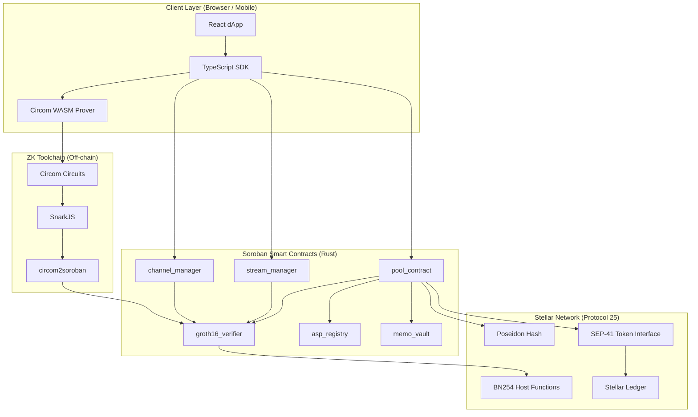

### Layer responsibilities

```mermaid
graph LR
    subgraph L1["Layer 1 — User"]
        A1[Web browser]
        A2[Mobile wallet]
    end

    subgraph L2["Layer 2 — SDK"]
        B1[Key generation]
        B2[Proof generation]
        B3[Tx construction]
        B4[Balance decryption]
    end

    subgraph L3["Layer 3 — Contracts"]
        C1[Pool logic]
        C2[ZK verification]
        C3[Compliance / ASP]
    end

    subgraph L4["Layer 4 — Cryptography"]
        D1[Groth16 zk-SNARKs]
        D2[ElGamal encryption]
        D3[BabyJubJub curve]
        D4[Poseidon hash]
    end

    subgraph L5["Layer 5 — Stellar"]
        E1[BN254 host fns]
        E2[Fast finality 5s]
        E3[Sub-cent fees]
    end

    L1 --> L2 --> L3 --> L4 --> L5
```

---

## Project Scaffold

```
stellar-encrypted-pay/
│
├── contracts/                          # Soroban smart contracts (Rust)
│   ├── pool_contract/
│   │   ├── Cargo.toml
│   │   └── src/
│   │       ├── lib.rs                  # Contract entry point
│   │       ├── deposit.rs              # Deposit instruction handler
│   │       ├── transfer.rs             # Private transfer handler
│   │       ├── withdraw.rs             # Withdrawal handler
│   │       ├── commitment.rs           # Commitment tree management
│   │       └── types.rs                # Shared types and structs
│   │
│   ├── groth16_verifier/
│   │   ├── Cargo.toml
│   │   └── src/
│   │       ├── lib.rs                  # Verifier contract entry point
│   │       ├── verifier.rs             # BN254 proof verification logic
│   │       └── vk.rs                   # Embedded verification keys
│   │
│   ├── asp_registry/
│   │   ├── Cargo.toml
│   │   └── src/
│   │       ├── lib.rs                  # ASP contract entry point
│   │       ├── membership.rs           # Membership Merkle tree
│   │       └── exclusion.rs            # Exclusion / blocklist management
│   │
│   ├── stream_manager/
│   │   ├── Cargo.toml
│   │   └── src/
│   │       ├── lib.rs                  # Streaming contract entry point
│   │       ├── stream.rs               # Stream open/close/withdraw
│   │       └── rate.rs                 # Rate commitment and time logic
│   │
│   ├── memo_vault/
│   │   ├── Cargo.toml
│   │   └── src/
│   │       ├── lib.rs                  # Memo vault entry point
│   │       └── memo.rs                 # Encrypted memo storage and retrieval
│   │
│   └── channel_manager/
│       ├── Cargo.toml
│       └── src/
│           ├── lib.rs                  # Payment channel entry point
│           ├── channel.rs              # Channel open/close/dispute
│           └── state.rs                # Off-chain state transition types
│
├── circuits/                           # Circom ZK circuits
│   ├── transfer/
│   │   ├── transfer.circom             # Main transfer validity circuit
│   │   ├── balance_check.circom        # Sender balance >= amount
│   │   └── double_spend.circom         # Nullifier uniqueness check
│   │
│   ├── deposit/
│   │   └── deposit.circom              # Deposit commitment circuit
│   │
│   ├── withdraw/
│   │   └── withdraw.circom             # Withdrawal ownership circuit
│   │
│   ├── stream/
│   │   ├── stream_open.circom          # Stream creation circuit
│   │   └── stream_claim.circom         # Vested amount claim circuit
│   │
│   ├── channel/
│   │   ├── channel_open.circom         # Channel opening commitment
│   │   └── channel_update.circom       # Off-chain state transition proof
│   │
│   └── lib/
│       ├── merkle.circom               # Merkle inclusion proof
│       ├── poseidon.circom             # Poseidon hash gadget
│       └── babyjubjub.circom           # BabyJubJub key operations
│
├── sdk/                                # TypeScript client SDK
│   ├── src/
│   │   ├── index.ts                    # SDK public API
│   │   ├── keys/
│   │   │   ├── keygen.ts               # BabyJubJub key generation
│   │   │   └── register.ts             # On-chain key registration
│   │   ├── proofs/
│   │   │   ├── prover.ts               # WASM proof generation wrapper
│   │   │   ├── transfer.ts             # Transfer proof builder
│   │   │   ├── stream.ts               # Stream proof builder
│   │   │   └── channel.ts              # Channel state proof builder
│   │   ├── transactions/
│   │   │   ├── deposit.ts              # Deposit tx constructor
│   │   │   ├── transfer.ts             # Transfer tx constructor
│   │   │   ├── withdraw.ts             # Withdraw tx constructor
│   │   │   └── stream.ts               # Stream tx constructors
│   │   ├── balance/
│   │   │   ├── decrypt.ts              # Balance decryption
│   │   │   └── sync.ts                 # Balance state sync from chain
│   │   ├── memo/
│   │   │   ├── encrypt.ts              # Memo encryption
│   │   │   └── decrypt.ts              # Memo decryption
│   │   └── compliance/
│   │       ├── selective_disclosure.ts # Selective disclosure proof gen
│   │       └── audit_export.ts         # Auditor key management
│   │
│   ├── wasm/                           # Compiled Circom WASM artifacts
│   │   ├── transfer_js/
│   │   ├── stream_js/
│   │   └── channel_js/
│   │
│   ├── package.json
│   └── tsconfig.json
│
├── frontend/                           # React dApp (Vite)
│   ├── src/
│   │   ├── App.tsx
│   │   ├── pages/
│   │   │   ├── Send.tsx
│   │   │   ├── Stream.tsx
│   │   │   ├── Channel.tsx
│   │   │   └── History.tsx
│   │   ├── components/
│   │   └── hooks/
│   ├── package.json
│   └── vite.config.ts
│
├── scripts/                            # Build and deployment scripts
│   ├── setup/
│   │   ├── trusted_setup.sh            # Powers-of-Tau ceremony
│   │   └── compile_circuits.sh         # Compile all Circom circuits
│   ├── deploy/
│   │   ├── deploy_testnet.sh           # Testnet deployment
│   │   └── deploy_mainnet.sh           # Mainnet deployment
│   └── generate_verifiers.sh           # Run circom2soroban on all circuits
│
├── tests/
│   ├── contracts/                      # Soroban contract unit tests
│   ├── circuits/                       # Circuit constraint tests
│   └── integration/                    # End-to-end flow tests
│
├── Cargo.toml                          # Workspace Cargo manifest
├── Cargo.lock
├── package.json                        # Root package manifest
├── .env.example                        # Environment variable template
└── README.md
```

---

## Smart Contract Architecture

### Contract interaction map

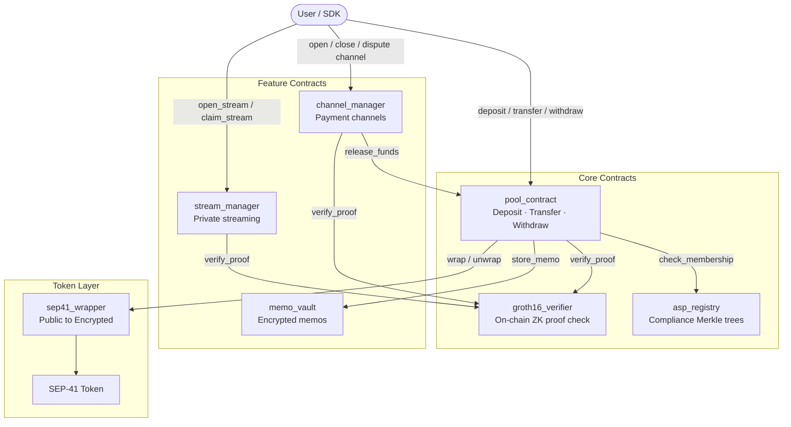

### Pool contract state machine

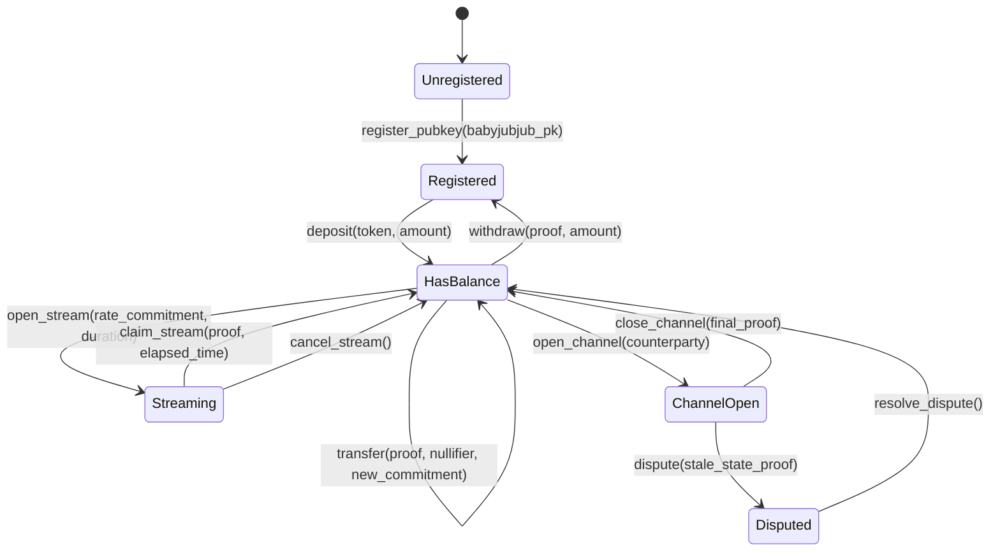

---

## ZK Circuit Design

### Circuit dependency graph

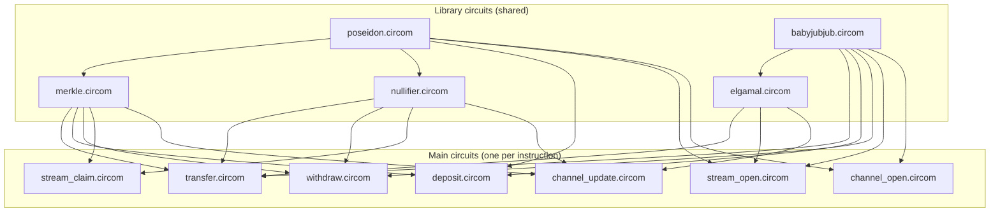

### Transfer circuit — what gets proven

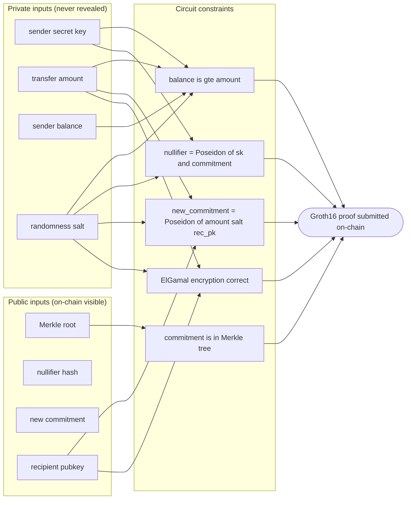

---

## Transaction Flows

### Full deposit → transfer → withdraw

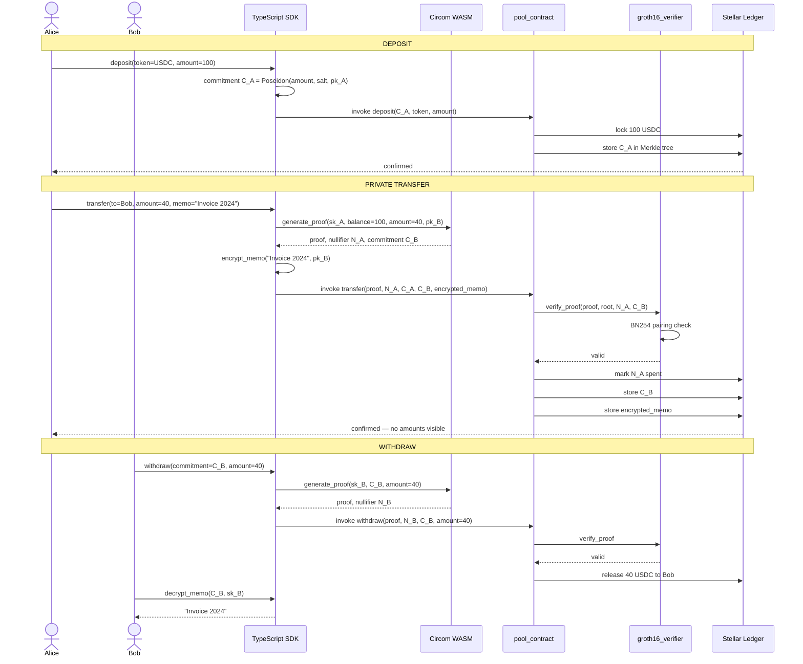

---

## Private Payment Channels

The most architecturally original feature. Two parties maintain an off-chain payment relationship where the running balance is a ZK commitment — only the final settlement hits the chain.

### Channel lifecycle

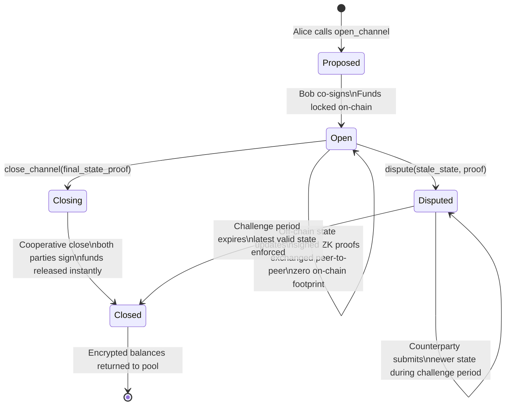

### Off-chain state update protocol

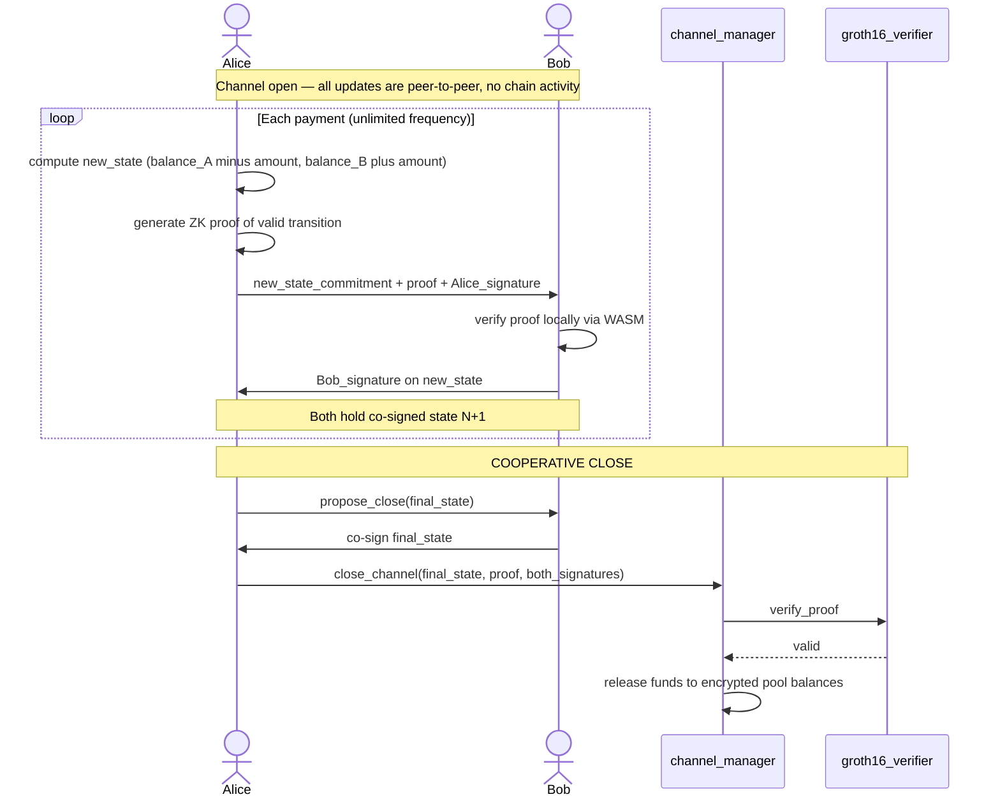

---

## Private Streaming Payments

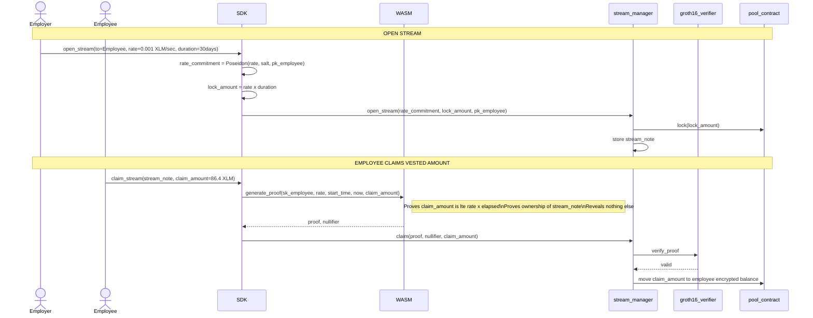

---

## Dependencies

### Rust workspace `Cargo.toml`

```toml
[workspace]
members = [
    "contracts/pool_contract",
    "contracts/groth16_verifier",
    "contracts/asp_registry",
    "contracts/stream_manager",
    "contracts/memo_vault",
    "contracts/channel_manager",
]

[workspace.dependencies]
soroban-sdk       = { version = "21.0.0", features = ["testutils"] }
soroban-token-sdk = "21.0.0"
serde             = { version = "1.0", default-features = false, features = ["derive"] }
serde_json        = { version = "1.0", default-features = false }
sha2              = { version = "0.10", default-features = false }
ark-bn254         = { version = "0.4", default-features = false }
ark-groth16       = { version = "0.4", default-features = false }
ark-serialize     = { version = "0.4", default-features = false }
```

### Root `package.json`

```json
{
  "name": "stellar-encrypted-pay",
  "workspaces": ["sdk", "frontend"],
  "devDependencies": {
    "circom": "^2.1.8",
    "snarkjs": "^0.7.4",
    "typescript": "^5.3.0",
    "ts-node": "^10.9.0",
    "vitest": "^1.0.0"
  },
  "dependencies": {
    "@stellar/stellar-sdk": "^12.0.0",
    "@stellar/stellar-base": "^12.0.0",
    "ffjavascript": "^0.3.0",
    "circomlibjs": "^0.1.7",
    "big.js": "^6.2.1"
  }
}
```

### System tools

| Tool | Version | Purpose | Install |
|---|---|---|---|
| Rust | ≥ 1.75.0 | Soroban contract compilation | `rustup update` |
| Soroban CLI | ≥ 21.0.0 | Contract deploy and invoke | `cargo install --locked soroban-cli` |
| Node.js | ≥ 20.0.0 | SDK and circuit toolchain | [nodejs.org](https://nodejs.org) |
| npm | ≥ 10.0.0 | Package management | bundled with Node |
| circom | ≥ 2.1.8 | ZK circuit compiler | `npm install -g circom` |
| snarkjs | ≥ 0.7.4 | Proof generation and setup | `npm install -g snarkjs` |
| circom2soroban | latest | Convert circuits to Soroban Rust | `cargo install circom2soroban` |

---

## Environment Setup

### 1. Rust and Soroban CLI

```bash
# Install Rust
curl --proto '=https' --tlsv1.2 -sSf https://sh.rustup.rs | sh
source $HOME/.cargo/env

# Add the wasm32 target (required for Soroban contract compilation)
rustup target add wasm32-unknown-unknown

# Install Soroban CLI
cargo install --locked soroban-cli

# Verify
soroban --version
```

### 2. Node.js toolchain

```bash
# Install Node.js via nvm (recommended)
curl -o- https://raw.githubusercontent.com/nvm-sh/nvm/v0.39.0/install.sh | bash
nvm install 20
nvm use 20

# Install global ZK tools
npm install -g circom snarkjs

# Verify
circom --version
snarkjs --version
```

### 3. circom2soroban

```bash
# Install the SDF circuit bridge tool
cargo install circom2soroban

# Verify
circom2soroban --help
```

### 4. Environment variables

Copy `.env.example` to `.env` and fill in your values:

```bash
cp .env.example .env
```

```env
# .env

# Stellar network
STELLAR_NETWORK=testnet
STELLAR_RPC_URL=https://soroban-testnet.stellar.org
STELLAR_NETWORK_PASSPHRASE="Test SDF Network ; September 2015"

# For mainnet use:
# STELLAR_RPC_URL=https://soroban-mainnet.stellar.org
# STELLAR_NETWORK_PASSPHRASE="Public Global Stellar Network ; September 2015"

# Deployer keypair (generate with: soroban keys generate deployer)
DEPLOYER_SECRET_KEY=S...

# Deployed contract IDs (populated after deploy)
POOL_CONTRACT_ID=
VERIFIER_CONTRACT_ID=
ASP_CONTRACT_ID=
STREAM_CONTRACT_ID=
MEMO_VAULT_CONTRACT_ID=
CHANNEL_CONTRACT_ID=

# Token to wrap (USDC on testnet)
TOKEN_CONTRACT_ID=CBIELTK6YBZJU5UP2WWQEUCYKLPU6AUNZ2BQ4WWFEIE3USCIHMXQDAMA

# Powers-of-Tau ceremony file path
PTAU_FILE=./circuits/setup/pot18_final.ptau
```

---

## Installation

```bash
# 1. Clone the repository
git clone https://github.com/your-org/stellar-encrypted-pay.git
cd stellar-encrypted-pay

# 2. Install all Node.js dependencies (SDK + frontend)
npm install

# 3. Build the Soroban contracts
cargo build --release --target wasm32-unknown-unknown

# 4. Download the Powers-of-Tau ceremony file (Groth16 trusted setup)
#    This is a one-time ~72MB download of a pre-existing ceremony
mkdir -p circuits/setup
curl -L https://hermez.s3-eu-west-1.amazonaws.com/powersOfTau28_hez_final_18.ptau \
     -o circuits/setup/pot18_final.ptau

# 5. Compile all Circom circuits and generate proving keys
chmod +x scripts/setup/compile_circuits.sh
./scripts/setup/compile_circuits.sh

# 6. Generate Soroban verifier Rust from circuit outputs
chmod +x scripts/generate_verifiers.sh
./scripts/generate_verifiers.sh

# 7. Build the TypeScript SDK
cd sdk && npm run build && cd ..
```

### What `compile_circuits.sh` does

```bash
#!/bin/bash
# scripts/setup/compile_circuits.sh
set -e

CIRCUITS=(transfer deposit withdraw stream_open stream_claim channel_open channel_update)

for circuit in "${CIRCUITS[@]}"; do
  echo "Compiling $circuit..."

  # Compile circuit to R1CS and WASM
  circom circuits/$circuit/$circuit.circom \
    --r1cs --wasm --sym \
    -o circuits/build/$circuit/

  # Generate Groth16 proving and verification keys
  snarkjs groth16 setup \
    circuits/build/$circuit/$circuit.r1cs \
    circuits/setup/pot18_final.ptau \
    circuits/build/$circuit/${circuit}_final.zkey

  # Export verification key as JSON
  snarkjs zkey export verificationkey \
    circuits/build/$circuit/${circuit}_final.zkey \
    circuits/build/$circuit/verification_key.json

  echo "  $circuit done"
done
```

### What `generate_verifiers.sh` does

```bash
#!/bin/bash
# scripts/generate_verifiers.sh
set -e

CIRCUITS=(transfer deposit withdraw stream_open stream_claim channel_open channel_update)

for circuit in "${CIRCUITS[@]}"; do
  circom2soroban vk circuits/build/$circuit/verification_key.json \
    > contracts/groth16_verifier/src/vk_${circuit}.rs
  echo "  vk_${circuit}.rs generated"
done
```

---

## Running the Project

### Start a local Stellar node

```bash
# Run Stellar Quickstart with Soroban support
docker run --rm -it \
  -p 8000:8000 \
  --name stellar \
  stellar/quickstart:latest \
  --local --enable-soroban-rpc

# Configure Soroban CLI for local
soroban config network add local \
  --rpc-url http://localhost:8000/soroban/rpc \
  --network-passphrase "Standalone Network ; February 2017"
```

### Deploy contracts

```bash
# Generate a deployer keypair and fund it
soroban keys generate deployer --network local
soroban keys fund deployer --network local

# Deploy all contracts (verifier first — pool depends on it)
./scripts/deploy/deploy_testnet.sh

# Copy the output contract IDs into your .env file
```

### Run the SDK in watch mode

```bash
cd sdk
npm run dev
```

### Run the frontend

```bash
cd frontend
npm run dev
# Opens at http://localhost:5173
```

### Run everything concurrently

```bash
# From the project root
npm run dev
# Starts: Stellar local node + SDK watcher + frontend dev server
```

---

## Testing

### Contract unit tests

```bash
# All contracts
cargo test

# Specific contract
cargo test -p pool_contract
cargo test -p groth16_verifier
cargo test -p stream_manager
cargo test -p channel_manager
```

### Circuit tests (generate and verify a proof)

```bash
cd circuits/transfer

# Generate witness
node generate_witness.js transfer_js/transfer.wasm input.json witness.wtns

# Generate proof
snarkjs groth16 prove \
  ../build/transfer/transfer_final.zkey witness.wtns \
  proof.json public.json

# Verify proof
snarkjs groth16 verify \
  ../build/transfer/verification_key.json public.json proof.json
```

### SDK tests

```bash
cd sdk
npm test
# Runs Vitest — covers key generation, proof building, tx construction
```

### End-to-end integration tests

```bash
# Requires local Stellar node running
npm run test:e2e

# Covers:
#   deposit → transfer → withdraw cycle
#   open_stream → claim_stream cycle
#   open_channel → update states → cooperative close cycle
#   dispute → challenge period → resolve cycle
```

---

## Deployment

### Testnet

```bash
# Fund deployer via Friendbot
soroban keys fund deployer --network testnet

# Deploy
./scripts/deploy/deploy_testnet.sh

# Verify pool is live
soroban contract invoke \
  --id $POOL_CONTRACT_ID \
  --network testnet \
  -- version
```

### Mainnet

```bash
# Protocol 25 is live on Mainnet since January 22, 2026
# Ensure deployer has sufficient XLM for fees
# Run a formal security audit of all contracts and circuits first

./scripts/deploy/deploy_mainnet.sh
```

---

## SDK Usage

### Initialise

```typescript
import { StellarEncryptedPay } from "@stellar-encrypted-pay/sdk";

const sep = new StellarEncryptedPay({
  network: "testnet",
  poolContractId: process.env.POOL_CONTRACT_ID,
  verifierContractId: process.env.VERIFIER_CONTRACT_ID,
  streamContractId: process.env.STREAM_CONTRACT_ID,
  channelContractId: process.env.CHANNEL_CONTRACT_ID,
});

// Generate a privacy keypair (separate from your Stellar keypair)
const privacyKey = await sep.keys.generate();

// Register your public key on-chain (one-time per wallet)
await sep.keys.register(stellarKeypair, privacyKey.publicKey);
```

### Deposit

```typescript
const receipt = await sep.deposit({
  tokenId: "CBIELTK6...",
  amount: "100",
  senderKeypair: stellarKeypair,
  privacyKey,
});
// receipt.commitment — your encrypted balance handle
```

### Private transfer with encrypted memo

```typescript
await sep.transfer({
  to: recipientPublicKey,
  amount: "40",
  memo: "Invoice #2024-Q1",   // encrypted — only recipient can read
  commitment: receipt.commitment,
  privacyKey,
  senderKeypair: stellarKeypair,
});
```

### Open a payment stream

```typescript
// Employer streams salary at 0.001 XLM per second for 30 days
const stream = await sep.stream.open({
  to: employeePrivacyKey,
  ratePerSecond: "0.001",
  durationSeconds: 30 * 24 * 60 * 60,
  tokenId: "CBIELTK6...",
  senderKeypair: stellarKeypair,
  privacyKey,
});

// Employee claims vested amount at any time
await sep.stream.claim({
  streamNote: stream.note,
  privacyKey: employeePrivacyKey,
  recipientKeypair: employeeStellarKeypair,
});
```

### Open a private payment channel

```typescript
// Open a channel with a business counterparty
const channel = await sep.channel.open({
  counterpartyPublicKey: partnerPrivacyKey,
  myDeposit: "1000",
  counterpartyDeposit: "1000",
  tokenId: "CBIELTK6...",
  myKeypair: stellarKeypair,
  privacyKey,
});

// Make payments off-chain — zero on-chain footprint
const updatedState = await sep.channel.update({
  channel,
  payAmount: "15",
  privacyKey,
});

// Cooperatively close — one on-chain transaction settles everything
await sep.channel.close({
  channel,
  finalState: updatedState,
  myKeypair: stellarKeypair,
  privacyKey,
});
```

---

## Feature Roadmap

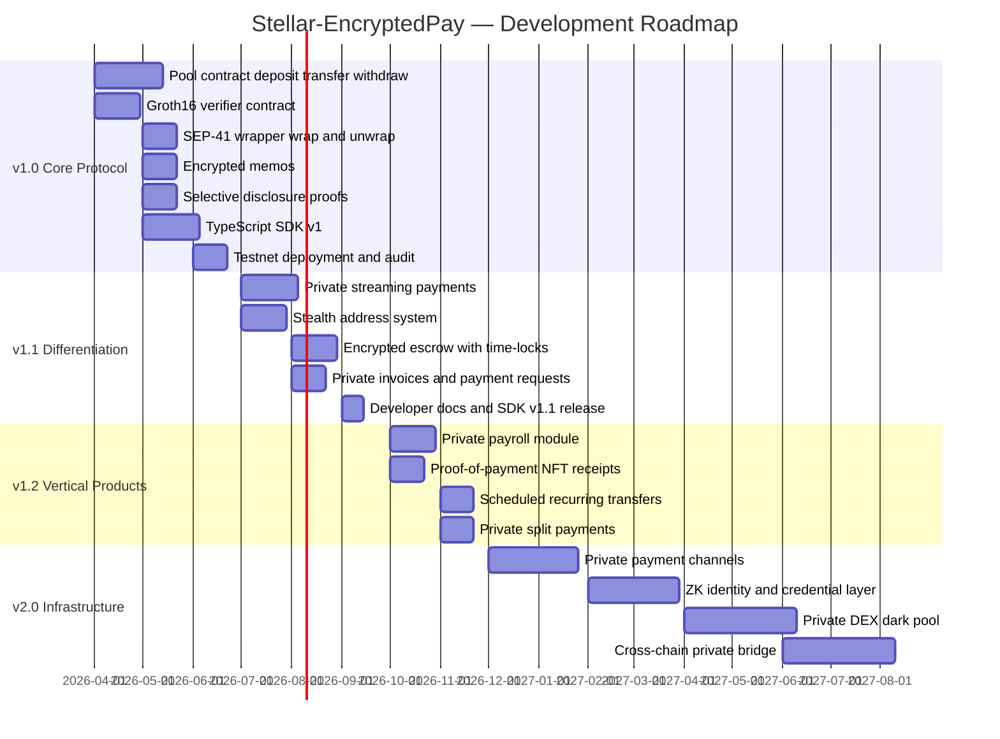

---

## Contributing

Contributions are welcome. Please open an issue before starting significant work.

```bash
# Fork and clone
git clone https://github.com/your-org/stellar-encrypted-pay.git

# Create a feature branch
git checkout -b feature/your-feature-name

# Run tests before committing
cargo test && npm test

# Submit a PR against main
```

Code standards: Rust contracts must pass `cargo clippy` with no warnings. TypeScript must pass `tsc --noEmit`. All new ZK circuits must include both unit tests and a documented sample input/output.

---

## License

MIT — see [LICENSE](LICENSE)

---

> Built on Stellar Protocol 25 (X-Ray). Inspired by Avalanche eERC and Stellar Private Payments (SPP).
> Leverages open-source work from the Stellar Development Foundation, iden3/circom, and the Nethermind ZK team.
=======

# STELLAR-EPay


#Project Documentation: https://docs.google.com/document/d/1PteAHLLHQlN499KjNcEHlvT6i8t1ziKS/edit?usp=sharing&ouid=105697343927857090340&rtpof=true&sd=true
>>>>>>> 3e09a22b6dce54a310bfd9aacd3c3364e033797c
