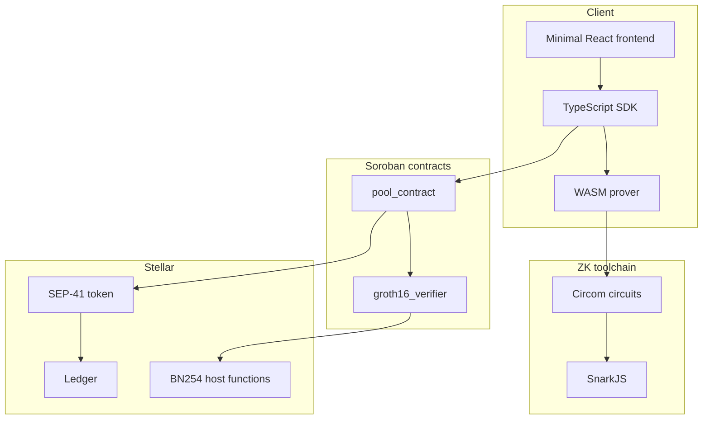

# Stellar-EncryptedPay

> Privacy-preserving payments on Stellar, built around a focused Soroban MVP: `deposit -> private transfer -> withdraw`.

[](LICENSE)
[-0F6E56)](https://stellar.org/blog/developers/announcing-stellar-x-ray-protocol-25)
[](https://soroban.stellar.org)
[](https://docs.circom.io)
[](https://github.com)

---

Project documentation: [Google Doc](https://docs.google.com/document/d/1PteAHLLHQlN499KjNcEHlvT6i8t1ziKS/edit?usp=sharing&ouid=105697343927857090340&rtpof=true&sd=true)

---

## Table of Contents

- [Overview](#overview)
- [Current Project Status](#current-project-status)
- [Why This Project Exists](#why-this-project-exists)
- [MVP Scope](#mvp-scope)
- [Out of Scope for v1.0](#out-of-scope-for-v10)
- [How the MVP Works](#how-the-mvp-works)
- [Privacy Model](#privacy-model)
- [MVP Architecture](#mvp-architecture)
- [Contracts](#contracts)
- [ZK Circuits](#zk-circuits)
- [SDK Surface](#sdk-surface)
- [Target Repository Structure](#target-repository-structure)
- [Build Plan](#build-plan)
- [Testing Strategy](#testing-strategy)
- [Deployment Plan](#deployment-plan)
- [Future Roadmap](#future-roadmap)
- [Contributing](#contributing)

---

## Overview

`Stellar-EncryptedPay` is a privacy-focused payments protocol for Stellar. The core idea is simple:

1. a user deposits a public Stellar asset into a Soroban pool
2. inside the pool, value is represented as private commitments instead of public balances
3. transfers happen with zero-knowledge proofs
4. the recipient can later withdraw back to a public asset

The long-term vision includes richer privacy features such as encrypted memos, selective disclosure, recurring payments, and possibly private streaming or channels. However, this repository is now aligned around a much tighter and safer objective:

**build a correct, testable, single-asset private pool first.**

---

## Current Project Status

This repository is currently documentation-first. The immediate goal is to turn the protocol idea into a credible implementation plan before expanding into advanced features.

This README intentionally separates:

- what the project is trying to become
- what the `v1.0` MVP must actually ship
- what should wait until the protocol core is proven

---

## Why This Project Exists

Stellar is excellent for fast, low-cost payments, but standard transfers expose too much information for many real-world use cases.

Examples:

- payroll where salary amounts should not be public
- B2B invoice settlement where transfer metadata should not be public
- treasury and vendor flows where balances and payment links should be harder to analyze

The goal of `Stellar-EncryptedPay` is to add a privacy layer on top of Stellar without giving up Soroban programmability or the ability to enter and exit through normal assets.

---

## MVP Scope

`v1.0` is intentionally narrow.

### The MVP must include

- one private pool
- one asset per deployed pool
- one verifier contract
- three user actions:
  - `deposit`
  - `private transfer`
  - `withdraw`
- a TypeScript SDK for proof generation and transaction submission
- a minimal frontend with only the above flows
- contract, circuit, and end-to-end tests

### The MVP success criteria

- a user can deposit a public asset into the pool
- a user can transfer a note privately to another user
- the recipient can withdraw successfully
- double spending is prevented with nullifiers
- invalid proofs are rejected on-chain
- the full flow can be reproduced locally and on testnet

---

## Out of Scope for v1.0

These features are valuable, but they should not be part of the first shipping milestone:

- private payment channels
- private streaming payments
- stealth addresses
- selective disclosure and compliance overlays
- encrypted memo storage
- multi-asset shared pools
- cross-chain features
- payroll or vertical-specific products

Reason: each of these adds meaningful complexity in protocol design, metadata privacy, state management, and security review. They should be layered on only after the pool model is correct.

---

## How the MVP Works

At a high level, the MVP behaves like a shielded pool:

```text
Public asset --deposit--> pool note --private transfer--> pool note --withdraw--> public asset
```

### Flow

1. The sender deposits a public Stellar asset into the pool contract.
2. The SDK derives a private note commitment for the depositor.
3. For a transfer, the sender generates a zero-knowledge proof off-chain.
4. The pool contract verifies the proof via the verifier contract.
5. The input note is nullified and a new output note is inserted.
6. The recipient later proves ownership and withdraws publicly.

### Important privacy boundary

For `v1.0`, deposits and withdrawals are public on-chain actions.

That means:

- pool-in amount is visible at deposit time
- pool-out amount is visible at withdrawal time
- internal pool transfers are where privacy is strongest

This is a more honest and safer framing than claiming total end-to-end invisibility from day one.

---

## Privacy Model

The protocol aims to hide or reduce visibility of the following during private transfers:

- transfer amount inside the pool
- sender/recipient link inside the pool
- current spendable note ownership

The protocol does **not** promise to hide everything in `v1.0`.

### Visible in v1.0

- deposit transactions
- withdrawal transactions
- contract interactions
- timing patterns
- note insertion cadence

### Reduced or hidden in v1.0

- internal transfer amount
- note ownership proof inputs
- the exact relationship between input and output notes, subject to metadata leakage limits

### Threat-model note

This project needs a formal threat model before mainnet. In particular, it must define what is hidden from:

- a chain observer
- a malicious sender
- a malicious recipient
- a relayer or indexer
- an auditor or regulated counterparty

---

## MVP Architecture

The MVP architecture uses only four moving parts:



### Design principles

- keep the protocol core small
- keep verification logic separate from pool accounting
- use one note model in `v1.0`
- use one asset per pool
- add optional features only after tests and sync logic are stable

---

## Contracts

The MVP should ship only two contracts.

### `pool_contract`

Purpose:

- hold pool state
- store note commitments
- track spent nullifiers
- handle deposits, transfers, and withdrawals

Responsibilities:

- accept the configured public asset
- add commitments to the Merkle tree
- reject already-spent nullifiers
- call the verifier contract
- release funds on valid withdrawal

Suggested methods:

- `init(token_id, verifier_id, tree_depth)`
- `deposit(recipient_pubkey, amount, salt, commitment)`
- `transfer(proof, root, input_nullifier, output_commitment)`
- `withdraw(proof, root, nullifier, amount, recipient_address)`
- `get_root()`
- `is_nullifier_spent(nullifier)`
- `version()`

### `groth16_verifier`

Purpose:

- verify zk-SNARK proofs and public inputs

Suggested methods:

- `verify_deposit(proof, public_inputs)`
- `verify_transfer(proof, public_inputs)`
- `verify_withdraw(proof, public_inputs)`

Design note:

The verifier contract should not own business logic. It should only verify proofs and return success or failure to the pool.

---

## ZK Circuits

The MVP should ship only three circuits.

### `deposit.circom`

Purpose:

- prove a note commitment is correctly formed

Public inputs:

- `commitment`

Private inputs:

- `amount`
- `owner_pubkey`
- `salt`

Core statement:

- `commitment = Poseidon(amount, owner_pubkey, salt)`

### `transfer.circom`

Purpose:

- prove the sender owns a valid existing note and creates a valid new note

Public inputs:

- `root`
- `input_nullifier`
- `output_commitment`

Private inputs:

- `input_amount`
- `input_salt`
- `owner_secret`
- `merkle_path`
- `recipient_pubkey`
- `output_amount`
- `output_salt`

Core statements:

- input note exists under `root`
- prover owns the input note
- nullifier is derived correctly
- output note is formed correctly
- transfer constraints are satisfied

### `withdraw.circom`

Purpose:

- prove the caller owns a note that can be burned for a public withdrawal

Public inputs:

- `root`
- `nullifier`
- `amount`
- `recipient_address`

Private inputs:

- `amount`
- `salt`
- `owner_secret`
- `merkle_path`

Core statements:

- note exists under the provided root
- prover owns the note
- nullifier is correct
- withdrawal amount matches the note

### MVP implementation choice

There are two valid transfer designs:

- `v1.0-alpha`: full-note transfer only, no change note
- `v1.0`: one input note and two output notes, one for recipient and one for change

If the goal is the fastest protocol validation, start with full-note transfer first and add change handling immediately after the proof flow is stable.

---

## SDK Surface

The SDK should expose a minimal, explicit API.

### Client setup

- `new StellarEncryptedPay(config)`
- `generatePrivacyKeypair()`
- `getPoolRoot()`
- `syncNotes()`

### Deposit flow

- `buildDeposit(params)`
- `proveDeposit(params)`
- `submitDeposit(params)`
- `deposit(params)`

Suggested shape:

```typescript
await sep.deposit({
  amount: "100",
  recipientPrivacyPubKey,
  senderKeypair,
});
```

### Transfer flow

- `buildTransfer(params)`
- `proveTransfer(params)`
- `submitTransfer(params)`
- `transfer(params)`

Suggested shape:

```typescript
await sep.transfer({
  inputNote,
  senderPrivacySecret,
  recipientPrivacyPubKey,
});
```

### Withdraw flow

- `buildWithdraw(params)`
- `proveWithdraw(params)`
- `submitWithdraw(params)`
- `withdraw(params)`

Suggested shape:

```typescript
await sep.withdraw({
  note,
  ownerPrivacySecret,
  recipientStellarAddress,
});
```

### Read and sync helpers

- `getNullifierStatus(nullifier)`
- `getCommitmentByIndex(index)`
- `listLocalNotes()`
- `importNote(note)`

Design note:

Wallet sync is a first-class requirement, not an afterthought. Private payments fail in practice if users cannot reliably discover, store, and recover notes.

---

## Target Repository Structure

This is the target scaffold for the first implementation phase.

```text
stellar-encrypted-pay/
├── contracts/
│   ├── pool_contract/
│   └── groth16_verifier/
├── circuits/
│   ├── deposit/
│   ├── transfer/
│   ├── withdraw/
│   └── lib/
├── sdk/
├── frontend/
├── tests/
│   ├── contracts/
│   ├── circuits/
│   └── integration/
├── scripts/
│   ├── setup/
│   └── deploy/
└── docs/
    └── protocol/
```

This layout exists in the repository today. The Soroban packages are intentionally small stubs (`version()` only) so you can validate your toolchain before implementing pool logic.

Notably absent in `v1.0`:

- `stream_manager`
- `channel_manager`
- `memo_vault`
- `asp_registry`

Those belong to later phases, not the initial build.

---

## Build Plan

The project should be implemented in this order.

### Phase 0: Protocol spec

Deliverables:

- note format
- nullifier derivation
- Merkle tree model
- circuit public/private inputs
- explicit privacy guarantees
- threat model

Exit criteria:

- no unresolved protocol ambiguity

### Phase 1: Circuits

Deliverables:

- `deposit.circom`
- `transfer.circom`
- `withdraw.circom`
- local proving scripts
- sample witness fixtures

Exit criteria:

- valid proofs generate and verify locally

### Phase 2: Verifier contract

Deliverables:

- `groth16_verifier`
- embedded verification keys
- proof input validation

Exit criteria:

- valid proofs pass on-chain and invalid proofs fail

### Phase 3: Pool contract

Deliverables:

- pool initialization
- deposit
- transfer
- withdraw
- root updates
- nullifier tracking

Exit criteria:

- contract invariants hold in tests

### Phase 4: SDK

Deliverables:

- proof wrappers
- transaction builders
- local note storage
- sync helpers

Exit criteria:

- a developer can execute the full flow through SDK only

### Phase 5: Minimal frontend

Deliverables:

- `Deposit` page
- `Transfer` page
- `Withdraw` page
- local note inspector

Exit criteria:

- a tester can complete the MVP flow without using the CLI

### Phase 6: Testnet hardening

Deliverables:

- environment config
- deployment scripts
- repeatable testnet flow
- failure-path integration tests

Exit criteria:

- stable end-to-end demo on testnet

---

## Testing Strategy

### Contract tests

Must cover:

- deposit inserts a valid commitment
- invalid proof is rejected
- reused nullifier is rejected
- withdrawal releases funds once
- stale or invalid root is rejected

### Circuit tests

Must cover:

- valid witness generation
- valid proof verification
- invalid Merkle path failure
- invalid owner secret failure
- invalid nullifier failure
- amount mismatch failure

### Integration tests

At minimum:

- Alice deposits
- Alice transfers privately to Bob
- Bob withdraws

Failure-path tests:

- replay attack with reused nullifier
- forged proof
- withdrawal against stale root

---

## Deployment Plan

### Local development

Required tools:

- Rust
- Soroban CLI
- Node.js
- `circom`
- `snarkjs`
- `circom2soroban`

Basic flow:

1. install dependencies
2. compile circuits
3. generate proving and verification artifacts
4. build contracts
5. start local Stellar node
6. deploy verifier first, then pool
7. run SDK and frontend against local network

### Testnet

Testnet is the first public proving ground for the protocol. Mainnet should not be considered until:

- the protocol spec is stable
- all core invariants are tested
- note sync and recovery are documented
- an external audit has been completed

---

## Future Roadmap

The roadmap is intentionally phased by dependency and risk. Everything below **after `v1.0`** is a planned direction, not a commitment or shipping order until each phase is specified in `docs/protocol` and backed by tests.

### `v1.0` Core private pool (current focus)

Ship first:

- single-asset pool per deployment
- `deposit`, private `transfer`, `withdraw`
- `pool_contract` + `groth16_verifier`
- Circom circuits: `deposit`, `transfer`, `withdraw`
- TypeScript SDK: proof generation, tx construction, basic note handling
- minimal frontend (three flows only)
- local + testnet deployment scripts
- contract, circuit, and end-to-end tests for the happy path and main failure modes

---

### `v1.1` Usability and protocol extensions

Goal: make the private pool practical for real wallets without changing the core trust model.

Planned additions:

- **Change notes**: one input, two outputs (recipient + change) so users do not need exact note denominations
- **Encrypted memos / invoices**: optional ciphertext or commitment + off-chain payload; fixed-size payloads where possible to limit metadata leakage
- **Note discovery and sync**: indexer or light-client strategy, spent/unspent tracking, reorg handling
- **Backup and recovery**: export/import of note material; documented key hierarchy (Stellar keys vs privacy keys)
- **Developer experience**: documented public inputs per circuit, local prover scripts, CI for circuits + contracts
- **Optional `memo_vault`-style module**: separate contract or module for memo storage so the pool stays focused on value movement

---

### `v1.2` Policy, compliance, and multi-asset preparation

Goal: optional regulated modes and safer asset handling **without** baking policy into the minimal pool path by default.

Planned additions:

- **Selective disclosure**: prove properties (for example bounds) without revealing exact amounts or full note details
- **`asp_registry` or equivalent**: membership / exclusion Merkle checks as an **optional** gate, versioned policies
- **Regulated deployment profile**: documented configuration where pools require compliance proofs before transfer or withdraw
- **SEP-41 multi-asset strategy**: either one pool per asset with clear addressing, or a audited wrapper pattern; explicit decimal and asset-id handling in circuits
- **Key registration / rotation flows** if the protocol requires on-chain privacy key metadata

---

### `v2.0` Advanced payment modes

Goal: product differentiators that depend on a stable `v1.x` pool and strong metadata analysis.

Planned additions:

- **Private recurring / scheduled payments**: time-based or counter-based commitments with clear privacy limits (timing may still leak coarse patterns)
- **`stream_manager` + circuits** (`stream_open`, `stream_claim`): salary-like streams with ZK-backed claims
- **Stealth or one-time receiving**: harder linking of deposits to recipients where the design allows it on Stellar
- **Encrypted escrow and time-locks**: release conditions proven in ZK or hybrid on-chain + ZK

---

### `v2.1` Private payment channels

Goal: high-frequency, low-footprint payments between two parties with on-chain open/close/dispute only.

Planned additions:

- **`channel_manager` + circuits** (`channel_open`, `channel_update`): bilateral channels, challenge windows, dispute resolution
- **Off-chain state + co-signed updates**: peer-to-peer proof exchange; optional watchtower / third-party monitoring story in docs
- **Settlement into the pool**: channels settle back into private notes or withdrawals as designed

---

### Longer-term vision (post `v2.x`, exploratory)

These items appeared in earlier product thinking and may never ship as described; they are **candidates** for research or far-future versions if the core protocol succeeds.

- **Private DEX / dark pool**-style liquidity (heavy ZK + MEV and liquidity design)
- **Cross-chain private bridge** (trust assumptions and bridge security dominate the design)
- **ZK identity / credentials layer** (sybil resistance, KYC-minimized proofs)
- **Vertical products**: private payroll modules, payment requests / invoices as first-class UX, split payments
- **Attestations or receipts** (for example NFT or verifiable credential style proof-of-payment), if there is a clear privacy story

Each of these needs its own threat model, economics, and audit plan before it belongs in a versioned roadmap.

---

### Why future work is split this way

Advanced features multiply attack surface (replay, state machine bugs, metadata leakage, liveness failures). They are grouped so that:

1. **Pool correctness** ships first (`v1.0`)
2. **Usability and memos** follow (`v1.1`)
3. **Policy and multi-asset** are opt-in layers (`v1.2`)
4. **Streams and channels** need mature sync and dispute semantics (`v2.0` / `v2.1`)
5. **Ecosystem-scale ideas** stay explicitly exploratory until grounded in shipped primitives

---

## Contributing

Contributions are welcome, but protocol changes should begin with design discussion before implementation.

Recommended order for contributors:

1. clarify the protocol behavior in `docs/protocol`
2. add or update circuit tests
3. add or update contract tests
4. add or update SDK integration tests

Engineering standards:

- Rust contracts should pass `cargo test` and `cargo clippy`
- TypeScript should pass `tsc --noEmit`
- new circuits must include sample inputs and expected outputs
- new protocol claims must document privacy assumptions and failure cases

---

## License

MIT — see [LICENSE](LICENSE)

---

> Built for Stellar Protocol 25 and Soroban. Inspired by the broader category of shielded payment systems, but intentionally scoped around a smaller and more credible MVP first.


